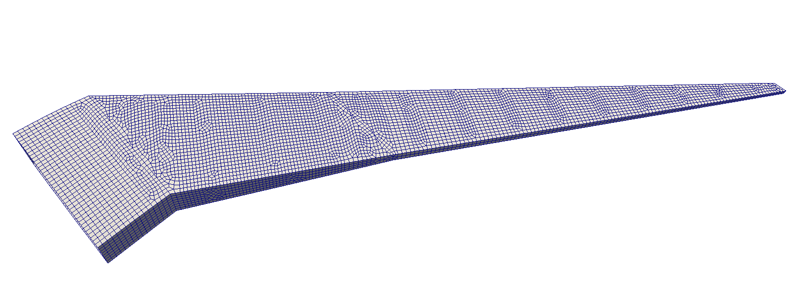

Common Research Model (CRM) wingbox
===================================

``egads4py`` can be used to create wingbox models that can then be meshed with TMR.
An example of this application can be found under ``examples/egads/crm`` which generates a STEP model of the undeformed CRM wing.
In this example, there are two steps to the creation of the STEP file:

1) The code ``oml.py`` reads in the IGES surface file and extracts the lofted airfoil curves.
   These curves are not all planar, so they are modified slightly and are projected so that they are parallel with the symmetry plane.
   This modified OML geometry is then written to the files ``ucrm_9_oml.egads`` and ``ucrm_9_oml.step``.
2) The code ``crm.py`` reads in the OML geometry.
   This code uses a doubly-connected edge loop (DCEL) data structure to create a planar layout of ribs and spars.
   This planar layout is then extruded in the vertical direction.
   The intersections between the ribs and spars and OML are computed and imprinted and the leading edge, trailing edge, and upper/lower spars and ribs.

.. image:: crm.png

Next, the ``ucrm_9_model.step`` file generated can be run through the example code in ``examples/step/step_import.py`` to generate the following unstructured quadrilateral mesh:

This code consists of the following steps:

* The command-line arguments are parsed to obtain ``htarget`` the global mesh spacing, ``filename`` the input file name, and ``output`` the optional output file name
* A :class:`~tmr.TMR.Model` instance is created by loading the STEP file ``geo = TMR.LoadModel(filename)``
* A new :class:`~tmr.TMR.Model` instance is created by discarding any :class:`~tmr.TMR.Volume` objects from the model
* Mesh options are set and the model is meshed, generating a new output
* The final mesh is written to a VTK file

.. code-block:: python

    from mpi4py import MPI
    from tmr import TMR
    import argparse
    import os

    # Set the communicator
    comm = MPI.COMM_WORLD

    # Create an argument parser to read in arguments from the commnad line
    p = argparse.ArgumentParser()
    p.add_argument('--htarget', type=float, default=4.0)
    p.add_argument('--filename', type=str, default=None, help='STEP file name')
    p.add_argument('--output', type=str, default='surface-mesh.vtk',
                help='output file name')
    args = p.parse_args()

    # Get the value of the filename
    filename = args.filename
    if not os.path.isfile(filename):
        raise ValueError('File %s does not exist'%(filename))

    # Set the value of the target length scale in the mesh
    htarget = args.htarget

    # Load the geometry model
    geo = TMR.LoadModel(filename)

    # Create a model by discarding the volumes
    verts = geo.getVertices()
    edges = geo.getEdges()
    faces = geo.getFaces()
    geo_new = TMR.Model(verts, edges, faces)

    # Create the new mesh
    mesh = TMR.Mesh(comm, geo_new)

    # Set the meshing options
    opts = TMR.MeshOptions()
    opts.write_mesh_quality_histogram = 1
    opts.triangularize_print_iter = 50000

    # Create the surface mesh
    mesh.mesh(htarget, opts)

    # Write the surface mesh to a file
    mesh.writeToVTK(args.output)