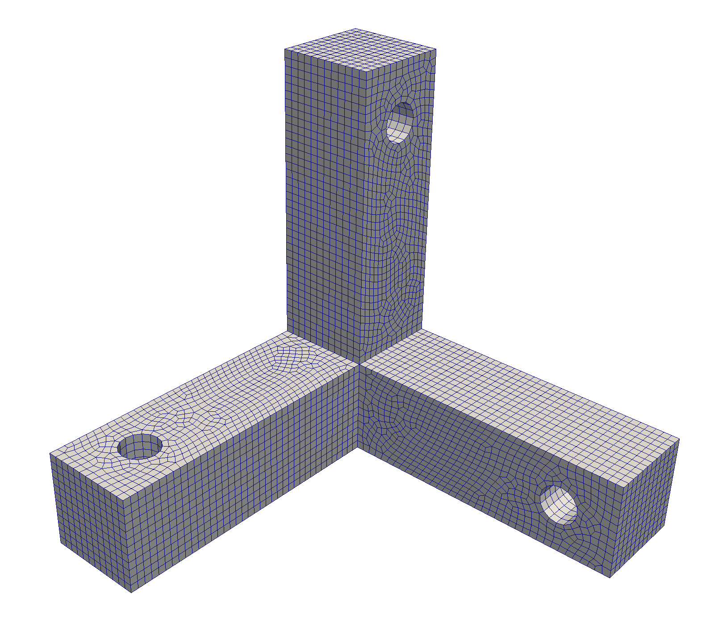

Orthogonal bracket
==================

The orthogonal bracket is an interesting test case for topology optimization.
It consists of three orthogonal, equally spaced members, with holes cut out in orthogonal directions.
The following code performs the following steps:

* Generates the orthogonal bracket geometry using egads4py's solid boolean operations
* Converts the egads4py objects to TMR-compatible geometry objects using ``TMR.ConvertEGADSModel``
* Collects all the TMR objects into a geometry model ``geo``
* Uses TMR's automatic coincident vertex, edge and face detection, and sweeping direction detection algorithm ``TMR.setMatchingFaces(geos)``.
* Creates the coarse mesh with the call ``mesh = TMR.Mesh(comm, geo)``. Note that the coarse mesh is created on the root processor and copied to all processors. This call will generate EGADS errors ``EGADS Error: Edge/Sense not in Face (EG_getEdgeUV)!`` since different models are connected.
* Creates a model from the new mesh ``model = mesh.createModelFromMesh()``, and uses that model to generate the topology object required for the forest-of-octrees object ``topo = TMR.Topology(comm, model)``
* Creates the forest of octrees ``forest = TMR.OctForest(comm)``
* Generates a random refinement and balances the mesh
* Writes out the mesh to a file

The complete code is shown below:

.. code-block:: python

    from mpi4py import MPI
    from egads4py import egads
    from tmr import TMR

    comm = MPI.COMM_WORLD

    # Create the egads context
    ctx = egads.context()

    parts = []

    r0 = 0.05

    # Create the boxes
    x0 = [0, 0, 0]
    x1 = [0.25, 0.25, 0.25]
    B0 = ctx.makeSolidBody(egads.BOX, rdata=[x0, x1])
    parts.append(ctx.makeTopology(egads.MODEL, children=[B0]))

    # Create the x-arm
    x0 = [0.25, 0, 0]
    x1 = [0.75, 0.25, 0.25]
    B1 = ctx.makeSolidBody(egads.BOX, rdata=[x0, x1])

    x0 = [0.85, 0.125, 0]
    x1 = [0.85, 0.125, 0.25]
    C1 = ctx.makeSolidBody(egads.CYLINDER, rdata=[x0, x1, r0])
    parts.append(B1.solidBoolean(C1, egads.SUBTRACTION))

    # Create the y-arm
    x0 = [0, 0.25, 0]
    x1 = [0.25, 0.75, 0.25]
    B2 = ctx.makeSolidBody(egads.BOX, rdata=[x0, x1])

    x0 = [0, 0.85, 0.125]
    x1 = [0.25, 0.85, 0.125]
    C2 = ctx.makeSolidBody(egads.CYLINDER, rdata=[x0, x1, r0])
    parts.append(B2.solidBoolean(C2, egads.SUBTRACTION))

    # Create the z-arm
    x0 = [0, 0, 0.25]
    x1 = [0.25, 0.25, 0.75]
    B3 = ctx.makeSolidBody(egads.BOX, rdata=[x0, x1])

    x0 = [0.125, 0,    0.85]
    x1 = [0.125, 0.25, 0.85]
    C3 = ctx.makeSolidBody(egads.CYLINDER, rdata=[x0, x1, r0])
    parts.append(B3.solidBoolean(C3, egads.SUBTRACTION))

    # Create all of the models
    geos = []
    for p in parts:
        geos.append(TMR.ConvertEGADSModel(p))

    # Create the full list of vertices, edges, faces and volumes
    verts = []
    edges = []
    faces = []
    vols = []
    for geo in geos:
        verts.extend(geo.getVertices())
        edges.extend(geo.getEdges())
        faces.extend(geo.getFaces())
        vols.extend(geo.getVolumes())

    # Set all of the matching faces
    TMR.setMatchingFaces(geos)

    # Create the geometry
    geo = TMR.Model(verts, edges, faces, vols)

    # Create the new mesh
    mesh = TMR.Mesh(comm, geo)

    # Set the meshing options
    opts = TMR.MeshOptions()
    opts.write_mesh_quality_histogram = 1
    opts.triangularize_print_iter = 50000

    # Create the surface mesh
    htarget = 0.02
    mesh.mesh(htarget, opts)

    # Write the surface mesh to a file
    mesh.writeToVTK('ortho_bracket.vtk', 'hex')

    # Create the model from the unstructured volume mesh
    model = mesh.createModelFromMesh()

    # Create the corresponding mesh topology from the mesh-model
    topo = TMR.Topology(comm, model)

    # Create the quad forest and set the topology of the forest
    forest = TMR.OctForest(comm)
    forest.setTopology(topo)

    # Create random trees and balance the mesh. Print the output file
    forest.createRandomTrees(nrand=1, max_lev=3)
    forest.balance(1)
    filename = 'ortho_forest%d.vtk'%(comm.rank)
    forest.writeForestToVTK(filename)
